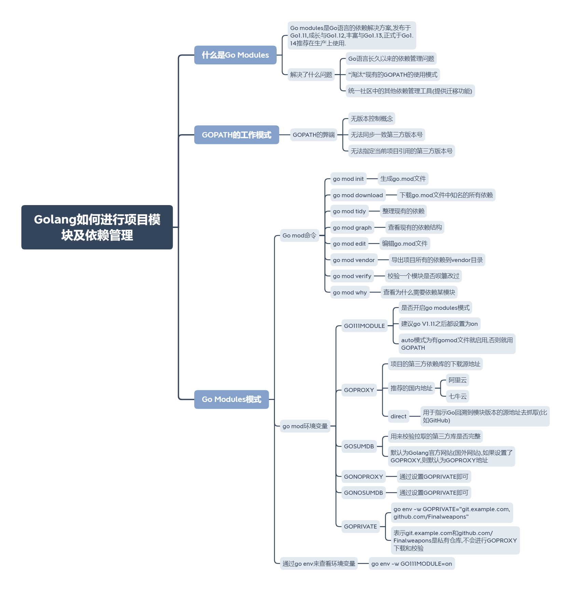

#Golang新手教程
>[HelloWorld](helloworld.go)
>>学习编程语言的第一个程序

>[变量](var.go)
>>创建变量的各种方法和作用空间

>[常量](const.go)
>>const关键字的使用方式 
>>iota的使用

>[函数](function.go) 
>>函数的定义格式 
>>返回值的定义格式

>[import导包](init)
>>导包的各种方式 
>>匿名导入,别名的使用方法

> [指针](pointer.go)
>> 大致与C语言的指针用法相差不多

> [defer](defer.go)
>> Go语言的析构函数

>[数组与切片(动态数组)的区别](slice.go)
>> 数组与切片作为参数时的不同 
>> range关键字的用法,以及匿名变量的使用
 
>[切片的四种定义方式](slice2.go)
>> 四种定义方式以及如何判断切片是否为空

>[切片的截取与追加](slice3.go)
>> 如何给数组增加元素,以及对应的内存操作
 
>[map的三种声明方式](map.go)
>>三种map的声明方式

>[map的使用方式](map2.go)
>>map的增删改
 
>[结构体及类的定义](struct.go)
>>面向对象的表示与封装

>[面向对象-继承的实现](struct2.go)
>>子类如何继承父类 子类的定义方式 父类方法重写及添加子类新方法

>[面向对象-多态的实现](struct3.go) 
>>多态的具体实现方法 
>>interface的定义

>[空数据类型interface与断言](interface.go)
>>断言的实现方法 interface的用法

>[变量的内置pair说明](pair.go)
>>三个例子讲解pair的作用

>[反射reflect](reflect.go)
>>什么是反射,反射可以干什么 
>>[反射遍历方法时的注意事项](reflect2.go)

>[结构体标签](tag.go)
>>通过反射获取结构体标签的内容
>> 将结构体与JSON进行互相转换

>[Goroutine](goroutine.go)
>>Go的协程 如何创建一个go协程

>[channel](channel.go)
>>如何创建一个channel(有缓冲或无缓冲) 
>>使用range遍历channel
>> 使用select进行多路监听

>Golang的项目模块及依赖管理
>
> 